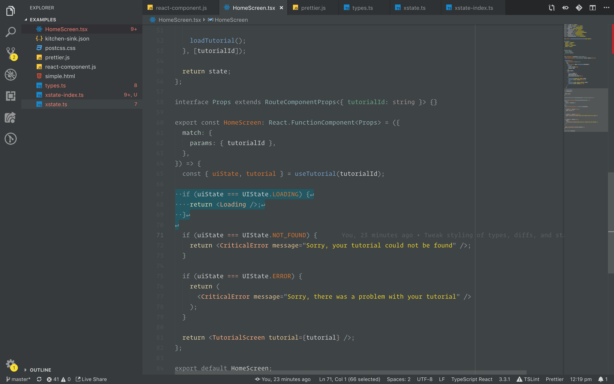

# Karl O'Keeffe's Theme

A custom theme for Visual Studio Code by Karl O'Keeffe.

Interesting features:

* Punctuation fades into the background.
* Only text within strings is coloured.
* Syntax highlighting within template strings.
* JSX attribute braces highlighted differently to object braces within an attribute.
* Variables coloured differently where they are initialised.
